# CICD Jenkins Pipeline Project 

DevOps CI/CD Project To Deploy Java Application using with Jenkins pipeline. Tools used Jenkins, Git, Terraform, Docker Engine, AWS Cloud (EC2,ECR,ECS), SonarQube, Nexus Repositoty Manager. 

## CICD Pipeline Workflow Diagram 

```mermaid   
flowchart LR
    s1[Github Push Trigger Pipeline] --> s2(Git Checkout)
    s2 --> s3(Maven Unit Testing)
    s3 --> s4(Maven Integration Testing)   
    s4 --> s5(Maven Build) 
    s5 --> s6(Maven Checkstyle Analysis)
    s6 --> s7(SonarQube Code Analysis)
    s7 --> s8(SonarQube QualityGate Status)
    s8 --> s9(Upload Artifact into Nexus Repository)
    s9 --> s10(Build App Docker Image)
    s10 --> s11(Upload App Image into AWS ECR Service)
    s11 --> s12(Deploy Image to AWS ECS Service)
    s12 --> s13(Send Build Notification to Slack Channel)
```  

## Steps To Perform  

* Create AWS Instances for Jenkins, SonarQube and Nexus  
* Integrate Jenkins with SonarQube  
* Configuring  Nexus Repository Management and Jenkins Server
* Implementing Pipeline utility for dynamic versioning   
* Setup Slack Notification      
* Creatiing Docker Image amd Push it into AWS ECR     
* Deploy Docker Image tyo ECS system     
* Setting up Jenkins Job Triggers    
* Setting up Periodic Scheduled Build Triggers    
* Authentication and Authorization        
